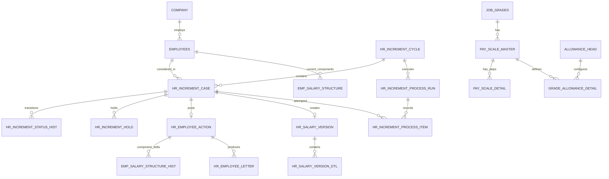

# Employee Annual Increment Management

> **Superseded APEX page map:** The approved simplified implementation now uses only Pages 500–503. See `Increment_Simple_4_Page_Design.md`. This document remains the detailed architecture/audit reference.

## Proposed Database Architecture and Oracle APEX Page Blueprint

**Page range:** 500–522  
**Design status:** Stages 1–3 complete as a proposal; the specifically approved EB/25-step basic rule is implemented in the repository, while the remaining module stays approval-gated  
**Source requirement:** `increment_Module_Design.md`  
**Target schema:** `HRMS`

---

## 1. Executive recommendation

Build the increment feature as a controlled, cycle-based transaction module, not as a salary-edit screen.

The recommended model has five layers:

1. **Increment cycle** — the period and organizational scope HR is processing.
2. **Employee increment case** — one immutable eligibility/consideration occurrence for one employee.
3. **Decision and status history** — every hold, release, defer, approval, processing, cancellation, and reversal.
4. **Salary versions** — complete before/after salary snapshots with component details.
5. **Process run** — the atomic batch execution, validation results, and technical outcome.

The APEX application should expose these layers through a dashboard, cycle workspace, consideration workbench, approval inbox, processing console, history/letter pages, and tightly controlled action dialogs beginning at page 500.

The UI must call a database package for all business actions. APEX automatic row processing may be used only for simple setup records. It must not directly update salary, eligibility dates, cycle statuses, or finalized increment records.

---

## 2. Business-rule interpretation

### 2.1 Eligibility

- Only a confirmed, active employee can enter normal annual increment consideration.
- First eligibility is based on confirmation date, not joining date.
- Recommended formula:

  `first consideration date = ADD_MONTHS(TRUNC(confirmation date), increment cycle months)`

- `employees.increment_cycle_months` defaults to 12 and should be snapshotted onto each increment case.
- `employees.next_increment_date` is a current-value cache for fast selection. The increment case and status history are the authoritative historical records.
- Employees without a confirmation date, a valid active grade/pay scale, or an active salary structure are ineligible and must appear in an exception list with a reason.

### 2.2 Consideration

- A consideration run uses the **full previous calendar month**. For the 01-Aug-2026 list, `PERIOD_FROM = 01-Jul-2026` and `PERIOD_TO = 31-Jul-2026`.
- The list date also identifies the target salary month: the 01-Aug-2026 list is the August 2026 increment/payroll list; the 01-Sep-2026 list is the September 2026 list.
- Generation selects new employees where `NEXT_INCREMENT_DATE BETWEEN PERIOD_FROM AND PERIOD_TO`.
- The operational list contains two sections:
  - **Newly due** — not previously generated and due inside the previous-month window;
  - **Carry forward** — an existing unresolved occurrence from an earlier list, with every active `TEMP_HOLD` included.
- A carried-forward case keeps its original increment ID, originating cycle, consideration date, and effective date. The next run displays it through a queue/view; it must not create a duplicate occurrence in the new cycle.
- A successfully processed employee is excluded from the operational list immediately because the occurrence is `PROCESSED` and the employee’s next anchored consideration date has advanced.
- Generation creates a case only once. Re-running generation adds newly eligible employees and refreshes only cases still in `DRAFT`; it never overwrites reviewed or finalized decisions.
- The case snapshots the employee, grade, scale, current basic, current gross, consideration date, proposed next basic, proposed gross, and calculation rule/version used.

Conceptual queue logic:

```text
PERIOD_FROM = add_months(trunc(list_date, 'MM'), -1)
PERIOD_TO   = trunc(list_date, 'MM') - 1
SALARY_MONTH = to_number(to_char(list_date, 'YYYYMM'))

NEWLY_DUE = employee.next_increment_date between period_from and period_to
            and no existing occurrence for that employee/date

CARRY_FORWARD = existing consideration_date < period_from
                and decision_code = TEMP_HOLD
                and status not in (PROCESSED, CANCELLED, REVERSED,
                                   CLOSED_NO_INCREMENT)

DISPLAY_LIST = NEWLY_DUE union CARRY_FORWARD
```

Database unique constraints remain the final protection against duplicate employee/date occurrences.

### 2.3 Decision and workflow status are separate

Do not use one overloaded status column for both the HR decision and the processing stage.

**Recommended decision codes**

| Code | Meaning | Receives current increment? | Effective-date behavior |
|---|---|---:|---|
| `PENDING` | No HR decision yet | Undecided | Original date retained |
| `APPROVE` | Recommend increment | Yes | Original date unless an approved policy changes it |
| `TEMP_HOLD` | Temporarily stop processing | Later | Original date must remain unchanged |
| `DEFER_FORFEIT` | Current annual increment is forfeited/stopped | No | No new salary version for this occurrence |
| `DEFER_DELAY` | Increment is delayed to an approved later effective date | Later | Revised date separately recorded; original date retained |
| `REJECT` | Not eligible/administratively rejected | No | No processing |

**Recommended workflow statuses**

| Status | Meaning |
|---|---|
| `DRAFT` | Generated and editable by preparer |
| `SUBMITTED` | Sent for approval; preparer can no longer edit |
| `APPROVED` | Authorized and eligible for processing according to decision |
| `PROCESSING` | Locked by a processing run |
| `PROCESSED` | Salary/action/history posted successfully |
| `ERROR` | A processing attempt failed and was rolled back |
| `CLOSED_NO_INCREMENT` | Reviewed occurrence closed because step 25/maximum is already reached |
| `CANCELLED` | Case cancelled before processing |
| `REVERSED` | A processed increment was reversed through an authorized transaction |

Decision/status combinations are constrained. Examples: `TEMP_HOLD` cannot be `PROCESSING`; `APPROVE` or released `DEFER_DELAY` is required before `PROCESSED`; only a `PROCESSED` case can become `REVERSED`.

### 2.4 Temporary hold

- A temporary hold preserves:
  - original consideration date;
  - original effective date;
  - proposed salary calculation;
  - annual-cycle anchor.
- Hold start, optional review date, reason, document/reference, maker, approver, release date, released by, and release remarks are recorded.
- A release makes the case processable. It does not substitute the release date for the effective date.
- Until released and processed, the case remains in each later monthly list as `CARRY_FORWARD / TEMP_HOLD`, even though its original cycle, occurrence, consideration date, and effective date remain unchanged. A July case held from the August list therefore appears in the 01-Sep-2026 list for September processing.
- If processing happens after payroll has already been finalized for an affected month, the increment module creates or requests a payroll arrears adjustment. It must not silently rewrite closed payroll.

### 2.5 Deferment

The word “deferred” is ambiguous and must not be implemented as a single action.

- `DEFER_FORFEIT`: the employee loses this occurrence. Next consideration normally remains on the annual anchor: original consideration date plus cycle months.
- `DEFER_DELAY`: the employee receives the increment later. Both original and revised effective dates are retained.
- Only an approved punishment decision using `DEFER_DELAY` may change the payable effective date. A normal delay or temporary administrative hold must never change it.
- For `DEFER_DELAY`, the next annual date can be anchored either to the original consideration date or to the revised effective date. The recommended default is the **original annual anchor** so disciplinary delay does not permanently drift the employee’s annual cycle, but this requires policy approval.

### 2.6 Approval

- Recommended segregation of duties: preparer cannot approve their own cycle or cases.
- Approval is performed against the submitted snapshot. Any later change to decision, amount, scale, or effective date invalidates approval and returns the case to `DRAFT` or `SUBMITTED`, according to policy.
- Approval records the approver, timestamp, comments, and the approved version number.

### 2.7 Processing

- Default processing mode is **strict atomic cycle processing**: all approved/processable cases succeed, or all salary/action/history changes roll back.
- Precheck runs before processing and must catch data problems without changing salary.
- The database API locks the cycle and all selected cases, revalidates current salary and duplicate constraints, writes salary versions and action history, updates the live structure, then updates employee dates.
- `processing timestamp` is recorded separately from the `effective date`.

### 2.8 Next increment date

- After normal processing: original consideration date plus the snapshotted increment cycle months.
- After temporary-hold release and processing: still original consideration date plus cycle months.
- After `DEFER_FORFEIT`: original consideration date plus cycle months.
- After `DEFER_DELAY`: recommended original consideration date plus cycle months, pending policy confirmation.
- After the employee reaches step 25/maximum basic: `NEXT_INCREMENT_DATE` is cleared so the employee does not re-enter future annual generation. A later promotion, regrade, or approved scale placement must explicitly establish a new scale position and next date.
- A reversal restores the next-date value captured before processing; it does not calculate a new value from the reversal date.

### 2.9 EB and 25-increment pay-scale rule

The supplied `PAY_SCALE_MASTER` data defines the same structure for all 20 scales:

- 10 pre-EB increments using `INCREMENT_1`;
- EB basic at step 10;
- 15 post-EB increments using `INCREMENT_2`;
- 25 total increment steps;
- maximum basic at step 25.

The following formulas are mandatory:

```text
TOTAL_INCREMENT_STEPS = STEPS_BEFORE_EB + STEPS_AFTER_EB = 25
EB_BASIC              = START_BASIC + (INCREMENT_1 × STEPS_BEFORE_EB)
MAX_BASIC             = EB_BASIC + (INCREMENT_2 × STEPS_AFTER_EB)
```

`PAY_SCALE_DETAIL.STEP_NO = 0` is the starting salary and is not counted as an annual increment. Steps 1–10 are pre-EB, step 10 is the EB point, and steps 11–25 are post-EB. Once the employee reaches step 25, no further increment is available even if another consideration date arrives.

When `EMPLOYEES.EB_STATUS = 'EB_HOLD'`, the employee cannot move onto the EB step or any post-EB step. The employee remains visible in consideration with blocking result `EB_HOLD`. After authorized EB clearance changes the status, the same occurrence can be recalculated and processed. Reaching step 25 produces `MAX_REACHED`; HR closes the consideration without a salary change while preserving the eligibility occurrence and audit trail.

The scale step—not a count of rows in action history—is the authoritative limit. This avoids incorrect results after data migration, pay-scale revision, confirmation placement, or promotion. Each processed increment must nevertheless snapshot the from-step, to-step, phase, EB-crossing flag, and remaining-step count for audit.

**Example using supplied Scale 1**

```text
Step 0  / Start basic :  46,550
Step 9  / Before EB   :  84,260
Step 10 / EB basic    :  88,450
Step 11 / Post-EB     :  92,760
Step 24               : 148,790
Step 25 / Maximum     : 153,100
```

- At step 9 with `EB_HOLD`, proposed basic remains 84,260 and processing is blocked.
- At step 9 after EB clearance, the employee moves once to step 10/basic 88,450.
- At step 24, the employee moves once to step 25/basic 153,100.
- At step 25, next increment status is `MAX_REACHED`, proposed increase is zero, and no salary update is allowed.

---

## 3. Existing-schema analysis

### 3.1 Relevant structures found

| Existing object | Relevant design observations |
|---|---|
| `EMPLOYEES` | PK `ID`; unique employee identifiers; contains `JOIN_DATE`, `CONF_DATE`, `CONFIRMATION_DUE_DATE`, `INCREMENT_CYCLE_MONTHS`, `LAST_INCREMENT_DATE`, `NEXT_INCREMENT_DATE`, hold cache columns, `EB_STATUS`, `JOB_ID`, text `GRADE`, `COM_ID`, department/designation/location and employee status fields. |
| `EMP_SALARY_STRUCTURE` | Live component rows by employee and `SLNO`; links employee by FK. Unique `(EMPLOYEE_ID, SLNO)`. `HEADCODE` is stored but has no declared FK. This is a live-state table, not a complete effective-dated history. |
| `EMP_SALARY_STRUCTURE_HIST` | Stores per-action old/new component amounts and effective date. Useful for compatibility/audit, but lacks declared FKs and immutable component-name/type snapshots. It is a delta log rather than a salary-version model. |
| `ALLOWANCE_HEAD` | Master salary-head metadata with unique code, earning/deduction type, fixed/percent calculation type and active flags. |
| `JOB_GRADES` | Grade master, PK `ID`, code/order and salary bounds. |
| `PAY_SCALE_MASTER` | Links to `JOB_GRADES`; effective dates and revision, basic/increment/EB/max values plus several allowance columns. Multiple revisions are possible. |
| `PAY_SCALE_DETAIL` | Scale steps with basic and increment values, EB marker, and phase. Unique scale/step. |
| `GRADE_ALLOWANCE_DETAIL` | Pay-scale/head calculation values with FK to scale and allowance head. This is preferable to hard-coded head lists. |
| `HR_INCREMENT_HOLD` | Existing hold history table, but supplied DDL has no `INCREMENT_ID`, FKs, status checks, or uniqueness preventing multiple active holds. |
| `HR_EMPLOYEE_ACTION` | General action header with old/new job, department, salary, EB and approval data. Supplied DDL has no `INCREMENT_ID`, original/revised effective-date columns, reversal link, or declared FKs. |
| `HR_EMPLOYEE_CAREER_HIST` | General career/action history. Increment need not duplicate unchanged job/designation/department here unless reporting policy requires it. |
| `HR_LETTER_TEMPLATE` / `HR_EMPLOYEE_LETTER` | Reusable letter infrastructure. Increment templates can be added with `ACTION_TYPE='INCREMENT'`; generated letters can link through `ACTION_ID`. |
| `MONTHLY_SALARY` and details | Payroll snapshot by employee/month. Only `DRAFT` salary is regenerable. There is an adjustment table, but no direct increment/arrears source identifier in supplied DDL. |
| Confirmation procedures | Set `CONF_DATE`, and calculate `NEXT_INCREMENT_DATE` from confirmation date. The DDL for `HR_CONFIRMATION` and its salary detail was not supplied. |

### 3.2 Relationship conclusions

- `EMPLOYEES.ID` is the employee key used by salary, actions, holds, payroll, and proposed increment cases.
- The actual grade relationship is unresolved. Current increment code treats `EMPLOYEES.JOB_ID` as `PAY_SCALE_MASTER.GRADE_ID`, while `DESIGNATIONS.GRADE` and `EMPLOYEES.GRADE` also exist. This must be normalized or resolved by one authoritative view before implementation.
- The current salary structure should remain the live compatibility table.
- The new salary-version tables should be the historical source for point-in-time reconstruction.
- `HR_EMPLOYEE_ACTION` remains the cross-module action/audit header; an increment case links to its posted action.
- Letters should use the existing template/letter framework.

### 3.3 Gaps and conflicts that block direct implementation

1. `HR_EMPLOYEE_INCREMENT` is referenced by procedures but no table DDL is supplied.
2. `PR_PREPARE_INCREMENT` is called by the hold procedure but no definition is supplied.
3. Increment procedures insert `INCREMENT_ID`, `OLD_EFFECTIVE_DATE`, and `NEW_EFFECTIVE_DATE` into `HR_EMPLOYEE_ACTION`, but those columns do not exist in the supplied table DDL.
4. Increment procedures query/write `HR_INCREMENT_HOLD.INCREMENT_ID`, but that column does not exist in the supplied DDL.
5. Current hold logic changes `HR_EMPLOYEE_INCREMENT.EFFECTIVE_DATE` to `HOLD_TO_DATE`; this violates the temporary-hold requirement.
6. Current release logic releases all active holds for an employee and does not identify the increment case; it can release the wrong occurrence.
7. The original processing code calculated `NEXT_INCREMENT_DATE` from the effective date, causing annual-cycle drift after delayed processing. The approved EB/25-step rule change now anchors it to the stored due date and clears it at maximum; the final package must retain that behavior.
8. Current calculation hard-codes salary head codes and special handling for `025`/`026`, despite the requirement to use the existing salary architecture dynamically.
9. Current processing assigns `GRADE_ID := EMPLOYEES.JOB_ID`; the authoritative job-to-grade relationship is not proven.
10. Payroll generation reads the current live structure without an as-of effective date. A retroactive increment can therefore require explicit arrears handling.
11. Transaction ownership is inconsistent: some procedures commit internally, others do not. Lower-level business procedures should never commit independently.
12. `MAX(id)+1` triggers on several masters are unsafe under concurrency. Identity or sequences should be used for new increment entities.
13. Several history/action tables lack declared FKs and status constraints, weakening audit integrity.
14. The pay-scale functions can encounter multiple active/effective revisions unless the effective-date selection and overlap constraints are made deterministic.

---

## 4. Required policy confirmations

These are review decisions, not reasons to stop the design. Recommended defaults are shown.

| Question | Recommended default |
|---|---|
| What exactly does punishment deferment mean? | Support separate `DEFER_FORFEIT` and `DEFER_DELAY` decisions. |
| Which date anchors the next annual increment after delayed deferment? | Original consideration date. |
| Does a temporary hold ever change effective date? | No. |
| How are arrears paid when release occurs after closed payroll? | Create linked monthly salary adjustments; never rewrite finalized payroll. |
| Is a mid-month effective date prorated? | Define a single payroll policy; default to day-based proration only if payroll already uses it. |
| Who is authoritative for grade: job, designation grade, or employee grade? | Add an authoritative employee-grade view/relationship and stop implicit `JOB_ID = GRADE_ID`. |
| Are employees at maximum basic listed? | Yes, as exceptions with `MAX_REACHED`; HR can close them without a salary change. |
| How is EB crossing approved? | Separate decision/authorization rule when next step crosses EB. |
| Is approval at cycle level, employee level, or both? | Employee decisions plus one cycle submission/approval; exceptions can be returned individually. |
| Can preparer and approver be the same user? | No in production. |
| Are cycles company-specific? | Yes; `COM_ID` is mandatory. |
| Can periods overlap? | No overlapping open cycle for the same company and increment type. |
| What statuses represent active/confirmed employees? | Confirm from production lookup data; do not hard-code numeric/string literals in APEX. |
| Can a processed increment be reversed after payroll is finalized? | Only through a privileged reversal plus compensating payroll adjustment. |
| Which rounding rule applies per salary head? | Store rule/precision in configuration and snapshot it in the salary version. |

---

## 5. Proposed logical entity model



`HR_INCREMENT_CASE` is the proposed logical name for the existing-but-missing `HR_EMPLOYEE_INCREMENT` object referenced in code. To minimize procedure churn, the physical name should be **`HR_EMPLOYEE_INCREMENT`**.

---

## 6. Proposed new tables

The following is a design specification, not executable DDL.

### 6.1 `HR_INCREMENT_CYCLE`

**Purpose:** One increment consideration batch for a company and period.

| Column | Type | Null? | Rule/purpose |
|---|---|---:|---|
| `CYCLE_ID` | `NUMBER` identity | No | PK |
| `CYCLE_CODE` | `VARCHAR2(30)` | No | Human reference, e.g. `INC-2025-07-01` |
| `CYCLE_NAME` | `VARCHAR2(150)` | No | e.g. `July 2025 Annual Increment` |
| `COM_ID` | `NUMBER` | No | FK to `COMPANY.ID` |
| `CYCLE_TYPE` | `VARCHAR2(20)` | No | Initially `ANNUAL`; extensible |
| `PERIOD_FROM` | `DATE` | No | Consideration-date range start |
| `PERIOD_TO` | `DATE` | No | Consideration-date range end |
| `AS_OF_DATE` | `DATE` | No | Monthly list date; normally first day, e.g. 01-Aug-2026 |
| `CUTOFF_DATE` | `DATE` | No | Same as `PERIOD_TO`; e.g. 31-Jul-2026 |
| `SALARY_MONTH` | `NUMBER(6)` | No | Target processing/payroll month in `YYYYMM`, e.g. `202608` |
| `DEFAULT_EFFECTIVE_DATE` | `DATE` | No | Default only; case stores its own date |
| `DEPT_ID` | `NUMBER` | Yes | Optional generation filter |
| `LOC_ID` | `NUMBER` | Yes | Optional generation filter |
| `STATUS` | `VARCHAR2(20)` | No | Cycle state |
| `TOTAL_CASES` | `NUMBER` | No | Cached count, default 0 |
| `APPROVE_COUNT` | `NUMBER` | No | Cached count, default 0 |
| `HOLD_COUNT` | `NUMBER` | No | Cached count, default 0 |
| `DEFER_COUNT` | `NUMBER` | No | Cached count, default 0 |
| `PROCESSED_COUNT` | `NUMBER` | No | Cached count, default 0 |
| `ERROR_COUNT` | `NUMBER` | No | Cached count, default 0 |
| `VERSION_NO` | `NUMBER` | No | Optimistic locking, default 1 |
| `SUBMITTED_BY/DATE` | `NUMBER`, `TIMESTAMP` | Yes | Submission audit |
| `APPROVED_BY/DATE` | `NUMBER`, `TIMESTAMP` | Yes | Approval audit |
| `PROCESSED_BY/DATE` | `NUMBER`, `TIMESTAMP` | Yes | Successful run audit |
| `CANCELLED_BY/DATE` | `NUMBER`, `TIMESTAMP` | Yes | Cancellation audit |
| `CANCEL_REASON` | `VARCHAR2(1000)` | Yes | Mandatory when cancelled |
| `REMARKS` | `VARCHAR2(1000)` | Yes | General notes |
| `CREATED_BY/DATE` | `NUMBER`, `TIMESTAMP` | No | Create audit |
| `UPDATED_BY/DATE` | `NUMBER`, `TIMESTAMP` | Yes | Update audit |

**Constraints and indexes**

- PK `CYCLE_ID`.
- Unique `(COM_ID, CYCLE_CODE)`.
- Check `PERIOD_TO >= PERIOD_FROM`.
- Check `AS_OF_DATE = TRUNC(AS_OF_DATE, 'MM')`, `PERIOD_FROM = ADD_MONTHS(AS_OF_DATE,-1)`, `PERIOD_TO = AS_OF_DATE-1`, `CUTOFF_DATE = PERIOD_TO`, and `SALARY_MONTH = TO_NUMBER(TO_CHAR(AS_OF_DATE,'YYYYMM'))`. Enforce derived values in the package because check constraints cannot safely use all expressions/functions across supported Oracle versions.
- Check cycle status in `DRAFT, GENERATED, UNDER_REVIEW, SUBMITTED, APPROVED, PROCESSING, COMPLETED, ERROR, CANCELLED`.
- Index `(COM_ID, STATUS, PERIOD_FROM, PERIOD_TO)`.
- Index `(STATUS, DEFAULT_EFFECTIVE_DATE)`.
- Prevent overlapping open annual cycles for a company in the package, protected by an application lock or serialized company/cycle lock.

### 6.2 `HR_EMPLOYEE_INCREMENT`

**Purpose:** The employee’s single increment occurrence within a cycle.

| Column group | Columns and types | Design rule |
|---|---|---|
| Identity | `INCREMENT_ID NUMBER` identity PK | Stable case identifier |
| Scope | `CYCLE_ID NUMBER`, `EMP_ID NUMBER`, `COM_ID NUMBER` | Mandatory FKs; company snapshotted for security/reporting |
| Eligibility | `CONFIRM_DATE DATE`, `CYCLE_MONTHS NUMBER(3)`, `CONSIDERATION_DATE DATE`, `ELIGIBILITY_SOURCE VARCHAR2(20)` | Immutable after submission |
| Dates | `ORIGINAL_EFFECTIVE_DATE DATE`, `REVISED_EFFECTIVE_DATE DATE`, `PROCESSING_DATE TIMESTAMP`, `NEXT_CONSIDERATION_DATE DATE` | Original date never overwritten |
| Employment snapshot | `JOB_ID`, `GRADE_ID`, `SCALE_ID`, `DESIG_ID`, `DEPT_ID`, `LOC_ID` as `NUMBER` | IDs used at calculation time |
| Salary snapshot | `OLD_BASIC`, `PROPOSED_BASIC`, `OLD_GROSS`, `PROPOSED_GROSS`, `INCREMENT_AMOUNT` as `NUMBER(14,2)`, `INCREMENT_PERCENT NUMBER(9,4)` | Calculated proposal |
| Scale-step snapshot | `FROM_STEP_NO NUMBER(3)`, `TO_STEP_NO NUMBER(3)`, `TOTAL_SCALE_STEPS NUMBER(3)`, `INCREMENT_PHASE VARCHAR2(10)`, `IS_EB_CROSSING VARCHAR2(1)`, `REMAINING_STEPS NUMBER(3)` | Enforces and audits the 25-step cap |
| Decision | `DECISION_CODE VARCHAR2(20)`, `DECISION_REASON_CODE VARCHAR2(30)`, `DECISION_REASON VARCHAR2(1000)` | Decision separate from workflow |
| Workflow | `STATUS VARCHAR2(20)`, `RETURN_REASON VARCHAR2(1000)` | Constrained state machine |
| Calculation outcome | `CALC_STATUS VARCHAR2(20)`, `CALC_MESSAGE VARCHAR2(1000)` | `AVAILABLE`, `EB_HOLD`, `MAX_REACHED`, `CONFIG_ERROR`, or `OFF_SCALE` |
| Processing links | `ACTION_ID NUMBER`, `OLD_SALARY_VERSION_ID NUMBER`, `NEW_SALARY_VERSION_ID NUMBER`, `LAST_RUN_ID NUMBER` | Traceability |
| Reversal | `REVERSED_ACTION_ID NUMBER`, `REVERSED_BY NUMBER`, `REVERSED_DATE TIMESTAMP`, `REVERSAL_REASON VARCHAR2(1000)` | Never delete a posted case |
| Concurrency | `VERSION_NO NUMBER`, `CALC_HASH VARCHAR2(64)` | Optimistic lock and stale-calculation detection |
| Audit | maker/submission/approval/processing/cancellation/reversal user and timestamps; created/updated user and timestamp | Complete audit |

**Constraints and indexes**

- Unique `(CYCLE_ID, EMP_ID)`.
- Unique business occurrence `(EMP_ID, CONSIDERATION_DATE)` for non-cancelled cases; implement with a function-based unique index if required.
- FK cycle, employee, company, grade, scale, action, salary versions, and process run.
- Checks for decision and status values.
- Check proposed basic/gross and increment amount are non-negative.
- Check `TOTAL_SCALE_STEPS = 25`, step numbers are between 0 and 25, `TO_STEP_NO = FROM_STEP_NO + 1` for a processed increment, and no processed case has `TO_STEP_NO > 25`.
- Check phase in `PRE_EB, EB, POST_EB, MAX`; EB crossing is `Y/N`.
- Check revised effective date is populated only for `DEFER_DELAY`.
- Check processing date exists only for processed/reversed cases.
- Index `(CYCLE_ID, STATUS, DECISION_CODE)`.
- Index `(EMP_ID, CONSIDERATION_DATE DESC)`.
- Index `(COM_ID, CONSIDERATION_DATE, STATUS)`.
- Index `(STATUS, ORIGINAL_EFFECTIVE_DATE)`.

### 6.3 `HR_INCREMENT_STATUS_HIST`

**Purpose:** Append-only business audit for every state or decision transition.

| Column | Type | Null? | Purpose |
|---|---|---:|---|
| `STATUS_HIST_ID` | `NUMBER` identity | No | PK |
| `INCREMENT_ID` | `NUMBER` | No | FK |
| `CYCLE_ID` | `NUMBER` | No | FK/report shortcut |
| `EVENT_CODE` | `VARCHAR2(30)` | No | `GENERATE`, `DECIDE`, `HOLD`, `RELEASE`, `SUBMIT`, `APPROVE`, `PROCESS`, `FAIL`, `CANCEL`, `REVERSE`, etc. |
| `OLD_STATUS`, `NEW_STATUS` | `VARCHAR2(20)` | Yes | Workflow transition |
| `OLD_DECISION`, `NEW_DECISION` | `VARCHAR2(20)` | Yes | Decision transition |
| `OLD_EFFECTIVE_DATE`, `NEW_EFFECTIVE_DATE` | `DATE` | Yes | Explicit date change audit |
| `REASON_CODE` | `VARCHAR2(30)` | Yes | Controlled reason |
| `REMARKS` | `VARCHAR2(2000)` | Yes | Mandatory for exceptional actions |
| `EVENT_BY` | `NUMBER` | No | Application user/employee key |
| `EVENT_DATE` | `TIMESTAMP` | No | Default current timestamp |
| `APEX_SESSION_ID` | `NUMBER` | Yes | Troubleshooting |
| `CLIENT_IDENTIFIER` | `VARCHAR2(128)` | Yes | Traceability |

No update/delete is allowed through the application. Index `(INCREMENT_ID, EVENT_DATE)` and `(CYCLE_ID, EVENT_CODE, EVENT_DATE)`.

### 6.4 `HR_SALARY_VERSION`

**Purpose:** Immutable, effective-dated header for a complete employee salary structure.

| Column | Type | Null? | Purpose |
|---|---|---:|---|
| `SALARY_VERSION_ID` | `NUMBER` identity | No | PK |
| `EMP_ID` | `NUMBER` | No | FK employee |
| `VERSION_NO` | `NUMBER` | No | Sequential per employee |
| `SOURCE_TYPE` | `VARCHAR2(20)` | No | `JOINING`, `CONFIRMATION`, `INCREMENT`, `PROMOTION`, `REVISION`, `REVERSAL` |
| `SOURCE_ACTION_ID` | `NUMBER` | Yes | FK action |
| `SOURCE_INCREMENT_ID` | `NUMBER` | Yes | FK increment case |
| `EFFECTIVE_FROM` | `DATE` | No | Business effective start |
| `EFFECTIVE_TO` | `DATE` | Yes | Closed when superseded |
| `IS_CURRENT` | `VARCHAR2(1)` | No | Exactly one current version per employee |
| `GRADE_ID`, `SCALE_ID`, `JOB_ID` | `NUMBER` | Yes | Historical relationship snapshot |
| `BASIC_AMOUNT`, `GROSS_EARNING`, `TOTAL_DEDUCTION`, `NET_AMOUNT` | `NUMBER(14,2)` | No | Version totals |
| `STATUS` | `VARCHAR2(20)` | No | `ACTIVE`, `SUPERSEDED`, `REVERSED` |
| `CALC_RULE_VERSION` | `VARCHAR2(50)` | Yes | Calculation trace |
| `CREATED_BY`, `CREATED_DATE` | `NUMBER`, `TIMESTAMP` | No | Audit |

**Constraints and indexes**

- Unique `(EMP_ID, VERSION_NO)`.
- Function-based unique index enforcing one `IS_CURRENT='Y'` row per employee.
- Effective range checks.
- No application updates except the controlled close of the previous version and reversal status through the package.
- Index `(EMP_ID, EFFECTIVE_FROM, EFFECTIVE_TO)` and `(SOURCE_INCREMENT_ID)`.

### 6.5 `HR_SALARY_VERSION_DTL`

**Purpose:** Immutable salary-component snapshot for one salary version.

| Column | Type | Null? | Purpose |
|---|---|---:|---|
| `SALARY_VERSION_DTL_ID` | `NUMBER` identity | No | PK |
| `SALARY_VERSION_ID` | `NUMBER` | No | FK, cascade prohibited at business layer |
| `HEAD_ID` | `NUMBER` | Yes | FK when head still exists |
| `HEAD_CODE_SNAPSHOT` | `VARCHAR2(20)` | No | Historical code |
| `HEAD_NAME_SNAPSHOT` | `VARCHAR2(150)` | No | Historical name |
| `HEAD_TYPE_SNAPSHOT` | `VARCHAR2(10)` | No | Earning/deduction |
| `CALC_TYPE_SNAPSHOT` | `VARCHAR2(10)` | Yes | Fixed/percent |
| `CALC_VALUE_SNAPSHOT` | `NUMBER(14,4)` | Yes | Rate/value used |
| `BASE_AMOUNT` | `NUMBER(14,2)` | Yes | Calculation base |
| `AMOUNT` | `NUMBER(14,2)` | No | Final component amount |
| `PRINT_ORDER` | `NUMBER(4)` | Yes | Historical display order |
| `IS_ACTIVE` | `VARCHAR2(1)` | No | Snapshot inclusion flag |
| `CREATED_BY`, `CREATED_DATE` | `NUMBER`, `TIMESTAMP` | No | Audit |

Unique `(SALARY_VERSION_ID, HEAD_CODE_SNAPSHOT)`. Index `(SALARY_VERSION_ID, PRINT_ORDER)`.

### 6.6 `HR_INCREMENT_PROCESS_RUN`

**Purpose:** One validation or posting attempt for a cycle.

| Column | Type | Null? | Purpose |
|---|---|---:|---|
| `RUN_ID` | `NUMBER` identity | No | PK |
| `CYCLE_ID` | `NUMBER` | No | FK |
| `RUN_TYPE` | `VARCHAR2(20)` | No | `PRECHECK`, `POST`, `REVERSE` |
| `STATUS` | `VARCHAR2(20)` | No | `RUNNING`, `PASSED`, `FAILED`, `ROLLED_BACK`, `COMPLETED` |
| `ATOMIC_MODE` | `VARCHAR2(10)` | No | Default `STRICT` |
| `REQUESTED_BY/DATE` | `NUMBER`, `TIMESTAMP` | No | Request audit |
| `STARTED_DATE`, `COMPLETED_DATE` | `TIMESTAMP` | Yes | Runtime |
| `TOTAL_ITEMS`, `SUCCESS_ITEMS`, `ERROR_ITEMS` | `NUMBER` | No | Counts |
| `ERROR_CODE` | `VARCHAR2(100)` | Yes | Top-level failure |
| `ERROR_MESSAGE` | `VARCHAR2(2000)` | Yes | Sanitized failure |
| `DB_TRANSACTION_ID` | `VARCHAR2(100)` | Yes | Trace |
| `APEX_SESSION_ID` | `NUMBER` | Yes | Trace |

Index `(CYCLE_ID, REQUESTED_DATE DESC)` and `(STATUS, STARTED_DATE)`.

### 6.7 `HR_INCREMENT_PROCESS_ITEM`

**Purpose:** Precheck/posting result for every employee case in a run.

| Column | Type | Null? | Purpose |
|---|---|---:|---|
| `RUN_ITEM_ID` | `NUMBER` identity | No | PK |
| `RUN_ID` | `NUMBER` | No | FK |
| `INCREMENT_ID` | `NUMBER` | No | FK |
| `EMP_ID` | `NUMBER` | No | FK/report shortcut |
| `STATUS` | `VARCHAR2(20)` | No | `PENDING`, `VALID`, `INVALID`, `POSTED`, `ROLLED_BACK`, `ERROR` |
| `VALIDATION_CODE` | `VARCHAR2(50)` | Yes | Machine-readable result |
| `MESSAGE` | `VARCHAR2(2000)` | Yes | User-safe detail |
| `OLD_CALC_HASH`, `NEW_CALC_HASH` | `VARCHAR2(64)` | Yes | Detect salary/config changes |
| `STARTED_DATE`, `COMPLETED_DATE` | `TIMESTAMP` | Yes | Runtime |
| `ERROR_BACKTRACE` | `CLOB` | Yes | Developer-only, privilege-protected |

Unique `(RUN_ID, INCREMENT_ID)`. Index `(INCREMENT_ID, RUN_ID)` and `(RUN_ID, STATUS)`.

---

## 7. Changes to existing tables

### 7.1 Required

| Table | Proposed change | Reason |
|---|---|---|
| `HR_INCREMENT_HOLD` | Add `INCREMENT_ID NOT NULL`, `REVIEW_DATE`, `REASON_CODE`, `DOCUMENT_REF`, approved/released audit; FKs to case, employee, action; status check; unique active hold per increment | Tie every hold to one occurrence and preserve complete history |
| `HR_EMPLOYEE_ACTION` | Add `INCREMENT_ID`, `OLD_EFFECTIVE_DATE`, `NEW_EFFECTIVE_DATE`, `REVERSAL_OF_ACTION_ID`, `SOURCE_MODULE`; add FKs/indexes | Align table with procedures and enable traceability |
| `EMP_SALARY_STRUCTURE_HIST` | Add FKs to action/employee where data quality permits; add index `(ACTION_ID, EMP_ID)` | Integrity and report performance |
| `HR_EMPLOYEE_LETTER` | Prefer adding `INCREMENT_ID` FK; otherwise enforce the link through increment `ACTION_ID` | Direct letter search and uniqueness |
| `MONTHLY_SALARY_ADJUSTMENT` | Add `SOURCE_TYPE`, `SOURCE_ID`, `EFFECTIVE_FROM`, and uniqueness preventing duplicate arrears | Safe retroactive increment adjustments |

### 7.2 Keep but define as cached/current state

- `EMPLOYEES.LAST_INCREMENT_DATE` and `NEXT_INCREMENT_DATE`: current operational cache, maintained only by the package.
- `EMPLOYEES.INCREMENT_HOLD_*`: optional current-hold cache for legacy screens. The authoritative hold is `HR_INCREMENT_HOLD`.
- `EMP_SALARY_STRUCTURE`: current live salary for existing payroll compatibility.
- `EMP_SALARY_STRUCTURE_HIST`: component delta compatibility/audit, written alongside complete salary versions.

### 7.3 Do not add old/new columns for every allowance

Salary components remain rows. Historical head code, name, type, calculation rule, and amount are snapshotted in version detail, so later edits to `ALLOWANCE_HEAD` or pay-scale configuration cannot rewrite history.

---

## 8. Date model and examples

### 8.1 Date definitions

| Date | Definition | Mutable? |
|---|---|---:|
| Joining date | Employment commencement; informational for increment | Existing HR correction only |
| Confirmation date | Starting anchor for first annual increment | Existing HR correction through controlled action |
| Eligibility/consideration date | Date employee completes the required interval | Immutable on generated occurrence |
| Original effective date | Normal date from which new salary is owed | Immutable |
| Revised effective date | Explicit later date for approved punishment `DEFER_DELAY` only | Controlled approval |
| Processing date | Timestamp salary transaction was posted | System generated |
| Next consideration date | Next annual eligibility anchor | Stored on case and cached on employee |

### 8.2 Normal case

- Join: 01-Jan-2024
- Confirm: 01-Jul-2024
- Cycle months: 12
- Consideration: 01-Jul-2025
- Original effective: 01-Jul-2025
- Processed: 25-Jun-2025 is not allowed if future posting is prohibited; approval can occur earlier and posting runs on/after effective date.
- Next consideration: 01-Jul-2026

### 8.2.1 Monthly cutoff example — 01-Aug-2026 list

```text
List / processing date : 01-Aug-2026
New-due period         : 01-Jul-2026 through 31-Jul-2026
Salary month           : 202608 / August 2026
Selection rule         : next_increment_date between
                         01-Jul-2026 and 31-Jul-2026
```

- A newly due employee dated anywhere from 01-Jul through 31-Jul appears.
- An employee already processed for that occurrence does not appear.
- A temporary hold from an earlier list remains visible as carry-forward.
- An employee due 01-Aug-2026 does not appear in the 01-Aug list; 01-Aug belongs to the August consideration window presented on 01-Sep-2026.

For a normal employee, consideration and original effective date remain on the annual confirmation anniversary. For example, confirmation on 31-Jul-2025 produces first consideration/effective date 31-Jul-2026. Processing on 01-Aug-2026 does not change the 31-Jul-2026 effective date.

### 8.2.2 Temporary-hold carry-forward — 01-Sep-2026 list

```text
Original consideration date : 15-Jul-2026
Original effective date     : 15-Jul-2026
First list / salary month    : 01-Aug-2026 / August 2026
Decision                     : TEMP_HOLD
Next displayed list          : 01-Sep-2026 / September 2026
Processing/payroll month     : September 2026
Effective date remains       : 15-Jul-2026
```

When released in September, the revised salary is processed in the September payroll workflow. Because the effective date remains 15-Jul-2026, any July/August difference is treated as arrears or adjustment under the approved payroll/proration policy. Temporary hold does not convert the effective date to 01-Sep-2026.

### 8.3 Temporary hold

- Consideration: 01-Jul-2025
- Original effective: 01-Jul-2025
- Hold: 28-Jun-2025
- Release: 15-Sep-2025
- Processing: 15-Sep-2025
- Salary owed from: 01-Jul-2025
- Next consideration: 01-Jul-2026
- July–August difference: linked payroll arrears/adjustments, depending on payroll status.

### 8.4 Forfeited punishment occurrence

- Consideration: 01-Jul-2025
- Decision: `DEFER_FORFEIT`
- No 2025 salary version is created.
- Next consideration: 01-Jul-2026, subject to policy confirmation.
- Original eligibility and punishment decision remain in history.

### 8.5 Delayed punishment occurrence

- Consideration/original effective: 01-Jul-2025
- Revised effective: 01-Oct-2025
- Processing: 01-Oct-2025 or later
- Salary owed from: 01-Oct-2025
- Next consideration: recommended 01-Jul-2026; alternate policy would be 01-Oct-2026.

---

## 9. Salary versioning and historical reconstruction

### 9.1 Posting sequence

For each case inside the single batch transaction:

1. Lock employee, increment case, and current salary version.
2. Verify the live salary hash still equals the proposal hash.
3. Read current live components and create/locate the complete “before” salary version.
4. Calculate all proposed heads from effective pay-scale and grade-allowance rules.
5. Create a complete immutable “after” salary version and details.
6. Close the previous version (`EFFECTIVE_TO = effective date - one day`, subject to date-granularity policy).
7. Update/merge the compatibility rows in `EMP_SALARY_STRUCTURE`.
8. Write component deltas to `EMP_SALARY_STRUCTURE_HIST` with the same action ID.
9. Write `HR_EMPLOYEE_ACTION`, link old/new versions, and finalize the case.
10. Update employee last/next increment cache fields.

### 9.2 Retrieval

- Current salary: current version or existing live structure.
- Salary as of a date: version where the date falls between effective from/to.
- Increment comparison: join case old/new version headers and details by snapshotted head code.
- Historical letter: render from version snapshots, never from current allowance/employee grade labels alone.
- If an employee, head, grade, or scale is renamed later, the historical version still displays the original snapshots.

### 9.3 Reversal

A reversal is a compensating transaction:

- never deletes the processed case, action, version, or history;
- creates a reversal action and salary version based on the stored “before” snapshot;
- marks the increment case `REVERSED`;
- restores cached employee dates from stored prior values;
- creates payroll adjustments if the increment affected finalized payroll;
- requires a reason, privileged authorization, and confirmation that later salary actions will not be invalidated.

---

## 10. Transaction, concurrency, and idempotency design

### 10.1 Package boundary

Create one public package in Stage 5, for example `PKG_HR_INCREMENT`, with APIs for:

- create/update cycle;
- generate eligible cases;
- recalculate one/all proposals;
- record decision/hold/release/defer;
- submit/return/approve cycle or cases;
- precheck cycle;
- process cycle;
- generate letter;
- reverse processed increment;
- retrieve validation messages and permitted actions.

APEX supplies IDs and user context; the package re-queries authoritative data. Never trust salary amounts, statuses, employee IDs, or effective dates merely because they are in session state.

### 10.2 Locking order

Use a consistent order to prevent deadlocks:

1. cycle row;
2. case rows ordered by employee ID;
3. employee rows ordered by ID;
4. current salary versions;
5. live salary components.

Use `SELECT ... FOR UPDATE NOWAIT` or a short wait and return a clear “being processed by another user” message.

### 10.3 Duplicate protection

- Unique cycle/employee and employee/consideration occurrence constraints.
- Status gates in the package.
- `VERSION_NO` on cycle and case for optimistic locking.
- Calculation hash across grade, scale revision, effective date, current component amounts, and relevant rules.
- A process run cannot be started when another `RUNNING` run exists for the cycle.
- Repeated processing of a `PROCESSED` case returns its existing action/version IDs; it never posts again.

### 10.4 Atomicity

- Public processing owns the transaction.
- Internal routines do not `COMMIT` or `ROLLBACK` independently.
- Default strict mode performs all cases in one transaction.
- If any case fails, all salary/action/version/case updates roll back.
- Technical run/error logging may use a narrowly scoped autonomous logger so the failure is visible after rollback; it must not modify business state.
- After rollback, cycle returns/stays `APPROVED`, run is `ROLLED_BACK` or `FAILED`, and no case is falsely marked processed.

### 10.5 Payroll protection

- Before posting, identify monthly salary records affected from effective date through current period.
- `DRAFT` payroll may be regenerated through a controlled integration.
- Approved/finalized payroll must receive linked adjustments; it is never regenerated silently.
- Re-running adjustment generation must be idempotent using source type/source ID/head/month uniqueness.

---

## 11. APEX application design standards

### 11.1 Shared components

**Application roles / authorization schemes**

- `INC_VIEW`
- `INC_PREPARE`
- `INC_REVIEW`
- `INC_APPROVE`
- `INC_PROCESS`
- `INC_LETTER`
- `INC_REVERSE`
- `INC_SETUP`
- `INC_AUDIT`

Enforce company/department row-level access in database views/package logic, not only by hiding navigation entries.

**Shared LOVs**

- Company, department, location, employee, grade, pay scale revision.
- Cycle status, case status, decision code, reason code.
- Active letter template.
- LOV queries must apply the user’s authorized company scope.

**Application items/context**

- Current authorized company ID.
- Application user/employee ID.
- User timezone and preferred date format.
- Do not store the selected cycle as an unrestricted global value; pass protected page items/checksums.

**Navigation**

- Dashboard
- Increment Cycles
- Approval Inbox
- Processing
- Hold & Defer Register
- Letters
- History & Reports
- Setup (authorized only)

**Other shared components**

- Breadcrumbs and page group `Annual Increment`.
- Global notification region for open/failed runs.
- Central APEX error-handling function mapping package error codes to safe messages.
- Build option for Stage 5 feature rollout.
- Email/notification templates for submit, return, approve, failure, hold review due, and letter issuance.
- Report download authorization; audit and salary exports are logged.

### 11.2 UX rules

- Use full pages for dense workbenches and comparisons.
- Use right-side drawer pages for contextual employee/cycle details.
- Use modal dialogs only for one focused action requiring a reason/confirmation.
- Do not allow direct editing of decision or status cells in an Interactive Grid. Selected-row action buttons call validated package APIs.
- Always show the three dates with explicit labels: consideration, effective, processed.
- Show original and revised effective dates together when deferment applies.
- Use consistent status badges and never rely on color alone.
- Display amounts with the application currency and consistent rounding.
- Preserve filters on return from drawer/dialog pages.
- All destructive or exceptional actions require a typed reason and a confirmation page/dialog.

---

## 12. Page map

| Page | Name | Type | Primary role |
|---:|---|---|---|
| 500 | Increment Dashboard | Dashboard | All authorized users |
| 501 | Increment Cycles | Faceted Search + Interactive Report | View/preparer |
| 502 | Create/Edit Cycle | Drawer | Preparer |
| 503 | Cycle Workspace | Master/detail full page | Preparer/reviewer/approver |
| 504 | Generate Eligible Employees | Modal wizard | Preparer |
| 505 | Consideration Workbench | Interactive Grid/report | Preparer/reviewer |
| 506 | Employee Increment Case | Drawer | Reviewer/approver |
| 507 | Decision Action | Modal | Reviewer |
| 508 | Submit Cycle | Modal confirmation | Preparer |
| 509 | Approval Inbox | Faceted Search/report | Approver |
| 510 | Approval Review | Full page | Approver |
| 511 | Processing Precheck | Full page | Processor |
| 512 | Processing Console | Full page | Processor |
| 513 | Process Run Results | Full page/report | Processor/auditor |
| 514 | Hold and Defer Register | Faceted Search/report | Reviewer/HR |
| 515 | Release or Re-decide | Modal | Reviewer/approver |
| 516 | Increment Letter Center | Interactive Report | Letter officer |
| 517 | Employee Increment History | Timeline/report | HR/viewer |
| 518 | Salary Version Comparison | Full page comparison | HR/auditor |
| 519 | Cycle Summary and Analytics | Charts + report | Management |
| 520 | Increment Audit Trail | Interactive Report | Auditor |
| 521 | Increment Setup | Full page | Setup administrator |
| 522 | Reverse Increment | Modal wizard | Privileged reverser |

---

## 13. Detailed APEX page guide

### Page 500 — Increment Dashboard

**Purpose:** Landing page and operational overview.

**Regions**

1. KPI cards: due this month, pending decisions, temporary holds, submitted for approval, ready to process, processing errors.
   Include separate EB-hold and maximum-step counts; maxed-out employees are informational, not processing backlog.
   Include `Newly Due` and `Carry Forward` counts for the selected monthly list and salary month.
2. “Current cycles” cards with progress bars by decision/status.
3. “Action required” report: overdue hold reviews, returned cases, failed prechecks, approved cycles past effective date.
4. Upcoming consideration chart for the next 12 months.
5. Recent activity timeline sourced from status history.

**Filters/items:** company and monthly list date; company defaults from authorized context.

**Buttons/links:** Create Cycle, Open Approval Inbox, Open Processing, View Holds. Each card links to the target page with protected filters.

**Behavior:** refresh dashboard regions after company change; cache only non-sensitive aggregate queries for a short period.

**Security:** page requires `INC_VIEW`; KPI queries enforce authorized company scope.

**Best-design note:** keep it action-oriented. Do not place editable data on the dashboard.

### Page 501 — Increment Cycles

**Purpose:** Find and manage cycle headers.

**Regions**

- Faceted search: company, year, cycle status, period, department/location scope, created by.
- Interactive report: code, name, list date, source consideration month, salary month, effective-date range, status, new/carry-forward/approved/hold/defer/processed/error counts, owner, last updated.

**Row links:** cycle code opens Page 503. Edit icon opens Page 502 only for editable statuses.

**Buttons:** Create Cycle, Clone Filters (not clone cycle), Export (authorization controlled).

**Validations/actions:** cancel is available through a controlled action only when no case is processed; reason required.

**Security:** view for `INC_VIEW`, create/edit for `INC_PREPARE`.

### Page 502 — Create/Edit Cycle

**Type:** right-side drawer.

**Items**

- Cycle ID (protected hidden), version number (protected hidden).
- Company, cycle code, name, cycle type.
- Period from/to, default effective date.
- Monthly list date, derived previous-month period, and salary month. For 01-Aug-2026 display “Newly due: 01-Jul-2026 through 31-Jul-2026; salary month: August 2026.”
- Optional department and location scope.
- Remarks.

**Dynamic behavior**

- Company cascades department/location LOVs.
- Name/code can be suggested from month/year but remain validated for uniqueness.
- Show a warning if the period contains no expected consideration dates.

**Buttons:** Save Draft, Save and Generate, Close.

**Validations**

- Period end not before start.
- Effective date policy valid.
- No overlapping open cycle in the same scope.
- Company is within user authorization.
- Once cases are submitted, only name/remarks may be changed; period/scope/dates are locked.

**Process:** call cycle API with version number; never automatic DML after generation.

### Page 503 — Cycle Workspace

**Purpose:** Main cockpit for one cycle.

**Header regions**

- Cycle title/status badge and action menu.
- Progress step: Draft → Review → Submitted → Approved → Precheck → Processed.
- KPI cards by decision and workflow status.
- Key dates and scope.

**Tabs/subregions**

1. Overview and notes.
2. Employees (embedded report linking to Page 505/506).
3. Exceptions.
4. Approval history.
5. Process runs.
6. Letters.

**Buttons shown by state/role:** Generate/Refresh Eligibility, Open Workbench, Submit, Withdraw Submission, Approve, Return, Run Precheck, Process, Cancel Cycle.

**Server conditions:** buttons use package “permitted action” checks, not status checks duplicated only in APEX.

**Refresh:** dialog-close refreshes header KPIs, employee region, and activity timeline.

### Page 504 — Generate Eligible Employees

**Type:** modal wizard with Review and Confirm steps.

**Step 1 — criteria:** display cycle scope, monthly list date, derived previous-month window and salary month; optional narrower department/location/employee filters; include maximum-basic exceptions; refresh existing draft proposals flag.

**Step 2 — preview:** newly due count, carry-forward count, temporary-hold count, already processed/excluded count, refreshable draft count, and exclusions grouped by reason.

**Step 3 — confirm:** type/display final summary; Generate button calls the package.

**Validation rules**

- Cycle must be `DRAFT`, `GENERATED`, or `UNDER_REVIEW`.
- Submitted/final cases are immutable.
- Employee confirmed and active according to authoritative lookup.
- A new case has its next consideration date inside the previous-month period, or an active temporary-hold occurrence qualifies for carry-forward.
- A processed occurrence is always excluded from the operational list.
- Grade, scale, salary basic, and effective scale revision resolve deterministically.

**Result:** return generated/skipped/error counts to Page 503. Detailed exclusions appear in the exception report rather than in a transient success message.

### Page 505 — Consideration Workbench

**Purpose:** High-volume HR review.

**Primary region:** Interactive Grid in read-mostly mode.

Use two saved views or tabs: `NEWLY DUE` and `CARRY FORWARD`. `NEWLY DUE` uses the full previous calendar month. `CARRY FORWARD` includes temporary holds from earlier monthly lists while retaining their original cycle reference and effective date.

**Columns**

- Select checkbox, employee code/name, department, designation, grade/scale.
- Confirmation and consideration dates.
- Original/revised effective dates.
- Old/proposed basic and gross, increment amount/percent.
- EB/max indicator.
- Current step, proposed step, phase, and remaining steps out of 25.
- Decision badge, workflow badge, reason, validation result.
- Last reviewed by/date.

**Toolbar actions:** Recalculate Selected, Approve Decision, Temporary Hold, Defer/Stop, Reject, Clear Draft Decision, Open Employee Case.

**Filters:** no decision, validation error, EB crossing, max reached, department, date, amount range, changed since generation.

`MAX_REACHED` cases are read-only and close as `CLOSED_NO_INCREMENT`; they cannot be included in selected-row approval or processing actions.

**Important implementation rule:** selection identifies case IDs only. Action dialogs gather the decision and call the package for every selected ID as one controlled request. Do not save editable status cells.

**Summary region:** selected employee count and total proposed monthly/annual cost impact.

**Security:** decisions require `INC_REVIEW`; salary visibility can be separately authorized if needed.

### Page 506 — Employee Increment Case

**Type:** wide drawer.

**Regions**

1. Employee card: employee code/name/photo, company, department, designation, grade, status.
2. Date card: joining, confirmation, consideration, original effective, revised effective, processing, next consideration.
3. Salary comparison: old/new components aligned by head; amount and variance.
4. Pay-scale position: current step, next step, EB/max marker, effective scale revision.
   Display `Step n of 25`, phase (`PRE-EB`, `EB`, `POST-EB`, `MAX`), remaining increments, and an EB-clearance warning.
5. Decision/approval card.
6. Status-history timeline.
7. Holds/deferment history and attachments/references.
8. Prior increments and salary actions.

**Buttons:** Recalculate, Make Decision, Return, Approve Case (if individual approval is enabled), View Full Salary Comparison.

**Checks:** show a prominent stale-proposal banner when current calculation hash differs.

**Security:** no inline salary update; all actions use role and permitted-action checks.

### Page 507 — Decision Action

**Type:** modal dialog reusable for one or many selected cases.

**Items**

- Selected case count and protected case-ID payload/collection reference.
- Decision code.
- Controlled reason code.
- Detailed reason/remarks.
- For temporary hold: review date and document reference; original effective date displayed read-only.
- For delayed deferment: revised effective date and next-date policy displayed explicitly.
- For forfeiture/reject: confirmation checkbox acknowledging no current salary version will be created.

**Dynamic behavior:** show only decision-specific fields; never relabel a hold date as effective date.

**Validations:** mandatory reason for all exceptional decisions; hold review date not before hold date; revised date after original for delay; cases must be editable and in same authorized scope.

**Process:** one package call with an APEX collection or JSON array validated server-side. Append a history event per case.

### Page 508 — Submit Cycle

**Purpose:** Final maker validation and submission.

**Regions**

- Decision counts and financial impact.
- Blocking issues: pending decisions, invalid salary calculations, missing reasons, unresolved grade/scale, overlapping employee occurrence.
- Non-blocking warnings: max reached, near-future holds, payroll periods affected.
- Maker declaration and comments.

**Buttons:** Validate Again, Submit, Cancel.

**Process:** package revalidates, stamps submission version/hash, changes cycle/cases atomically, and notifies approvers.

**Rule:** submission is disabled while blockers exist. The page cannot override blockers.

### Page 509 — Approval Inbox

**Purpose:** Approver’s cross-cycle work queue.

**Regions:** faceted search and interactive report by company, cycle, submission date, preparer, amount impact, exception count, overdue days.

**Columns:** cycle, scope, counts, total increase, submitted by/date, approval SLA, stale flag.

**Links:** open Page 510. No one-click approval from the report; approver must view the decision summary.

**Security:** `INC_APPROVE`, company-scope enforcement, maker-check.

### Page 510 — Approval Review

**Purpose:** Review a submitted cycle without editing it.

**Regions**

1. Cycle and maker summary.
2. Decision distribution and financial-impact cards.
3. Employee report with drill to Page 506.
4. Holds and deferments report with reasons.
5. Validation/EB/max exceptions.
6. Approval history and comments.

**Buttons:** Approve Cycle, Return Selected Cases, Return Whole Cycle, Reject/Cancel (if policy allows).

**Approval dialog:** requires comments for return/reject; confirms maker/approver separation and calculation hash.

**Process:** revalidate that no underlying salary/grade/scale/config changed since submission. A stale cycle is returned for recalculation, not approved with outdated figures.

### Page 511 — Processing Precheck

**Purpose:** Dry-run validation with zero salary changes.

**Regions**

- Precheck header: cycle, effective dates, cases ready, requested by/time.
- Validation matrix per case.
- Payroll impact: draft/final salary months affected, expected arrears.
- Blocking issue summary grouped by code.
- Calculation totals and hash reconciliation.

**Buttons:** Run/Refresh Precheck, Export Errors, Go to Case, Continue to Processing.

**Blocking examples:** active hold, unapproved case, salary changed, duplicate salary heads, missing scale, multiple effective scales, future effective date if posting policy forbids it, existing processed occurrence, finalized payroll without adjustment policy.

Additional mandatory scale checks are: master formulas reconcile, exactly 26 generated detail rows exist (step 0 plus 25 increments), step numbers are continuous 0–25, the employee is not already at step 25, and an `EB_HOLD` employee is not crossing/reaching EB.

**Rule:** Continue is enabled only for a successful, current precheck whose hash matches current data.

### Page 512 — Processing Console

**Purpose:** Execute the approved cycle.

**Regions**

- Immutable processing summary: case count, total old/new gross, total increase, effective date distribution, payroll impact.
- Latest passed precheck and age.
- Transaction mode badge: `STRICT — ALL OR NOTHING`.
- Processor acknowledgment.

**Buttons:** Process Cycle, Cancel.

**Confirmation:** require a typed cycle code for high-impact posting.

**Execution:** submit an APEX background execution or scheduler job for large cycles; immediately create a run ID and redirect to Page 513. Small cycles may run synchronously if measured safe.

**Concurrency:** package obtains cycle lock and rejects duplicate runs.

**Security:** `INC_PROCESS`; recommended processor distinct from preparer. Session-state protection enabled for all IDs.

### Page 513 — Process Run Results

**Purpose:** Monitor and diagnose a precheck/post/reversal run.

**Regions**

- Run status, start/end/duration, counts, requestor, transaction ID.
- Progress bar while running; bounded polling dynamic action.
- Item results report with employee/case/status/code/message.
- Technical error region visible only to developer/auditor role.
- Business changes summary after success: actions, salary versions, letters pending, payroll adjustments.

**Buttons:** Refresh, Open Failed Case, Re-run Precheck, Go to Letters, Download Authorized Result.

**Rule:** a rolled-back strict run must show zero posted business cases even if item validation succeeded before the failure.

### Page 514 — Hold and Defer Register

**Purpose:** Operational follow-up for non-normal decisions.

**Facets:** company, decision type, active/released, hold review due, cycle, employee, department, reason code, original/revised effective date.

**Report columns:** employee, cycle, decision, consideration, original effective, revised effective, hold/review dates, days open, reason, created/approved by, next action.

Every active temporary hold appears as carry-forward on later monthly list dates until that exact occurrence is released and processed or otherwise closed.

**Actions:** Open Case, Release/Re-decide (Page 515), export with privilege.

**Alerts:** overdue review date, past-effective temporary holds, payroll arrears likely.

### Page 515 — Release or Re-decide

**Type:** modal dialog for exactly one case.

**Items:** increment ID protected, current decision/status, original/revised effective dates, original reason, new action (`RELEASE_TO_APPROVE`, `EXTEND_REVIEW`, `CHANGE_TO_DEFER_DELAY`, `CHANGE_TO_DEFER_FORFEIT`, `CANCEL`), new review/revised date, reason and remarks.

**Rules**

- Release targets one increment ID, never every hold for an employee.
- Temporary-hold release preserves original effective date.
- Changing decision after approval invalidates approval and returns through workflow.
- Closed/processed/reversed cases cannot be changed here.

**Process:** package appends status history and closes the specific active hold row.

### Page 516 — Increment Letter Center

**Purpose:** Generate, approve, issue, and reprint letters after processing.

**Regions**

- Report of processed cases and letter state (`NOT_GENERATED`, `DRAFT`, `APPROVED`, `ISSUED`, `CANCELLED`).
- Filters by cycle, company, department, letter state and issue date.
- Template selector and preview drawer.

**Actions:** Generate Selected, Preview, Approve Letter, Issue, Download PDF, Email/notify if configured.

**Data source:** employee/action and immutable old/new salary versions. The stored letter body remains the legal snapshot.

**Controls:** unique increment/template or increment/letter-type generation; re-generation creates a new draft/version rather than overwriting an issued letter.

### Page 517 — Employee Increment History

**Purpose:** Complete employee-centric timeline.

**Items:** employee smart search; monthly list/as-of date.

**Regions**

- Employee summary and current next consideration date.
- Timeline of confirmation, eligibility, increment decisions, holds, deferments, processing, letters, reversals.
- Increment report with consideration/effective/processing dates, cycle, old/new basic/gross, decision/status, approver/processor.
- Related payroll adjustment summary.

**Links:** Page 506 case, Page 518 salary comparison, issued letter.

**Security:** salary details and audit identities controlled separately if required.

### Page 518 — Salary Version Comparison

**Purpose:** Reconstruct and compare any two immutable salary versions.

**Items:** employee, left version/date, right version/date, “show unchanged heads” switch.

**Regions**

- Header comparison: effective dates, source, grade, scale, basic, gross, deductions, net.
- Component matrix: head code/name/type, old amount, new amount, variance, percent, calculation snapshot.
- Totals and reconciliation.
- Print/download region.

**Validation:** both versions belong to the selected employee and user-authorized company.

**Best-design note:** full-page layout is preferable to a modal because salary-component comparison is dense and printable.

### Page 519 — Cycle Summary and Analytics

**Purpose:** Management reporting.

**Regions**

- Cycle KPI cards and cost impact.
- Decision distribution chart.
- Department/grade cost-impact charts.
- Processing lead-time metrics: consideration-to-approval and approval-to-processing.
- Hold/defer aging.
- Detailed downloadable report.

**Filters:** cycle/company/year/department/grade; amounts respect authorized scope.

**Rule:** charts drill into filtered reports, not unprotected SQL URLs.

### Page 520 — Increment Audit Trail

**Purpose:** Read-only audit across all cycles/cases.

**Regions:** Interactive Report over status history joined to cycle/employee labels; process-run report; privileged technical trace.

**Columns:** event time, actor, company, cycle, employee, event, old/new status, old/new decision, old/new effective date, reason, APEX session/client identifier.

**Filters:** date range mandatory/defaulted for performance; cycle, employee, actor, event, decision.

**Security:** `INC_AUDIT`; no edit/delete; export is logged.

### Page 521 — Increment Setup

**Purpose:** Configuration hub, not direct master-table free editing.

**Tabs**

1. Increment policies: cycle months/default next-date anchor, future-posting policy, proration, arrears policy.
2. Decision reason codes and required-document flags.
3. Grade/pay-scale diagnostic view with effective revision overlap warnings.
   The scale editor/diagnostic must show pre-EB steps, post-EB steps, total steps, computed EB basic, and computed maximum basic. Save is blocked unless the total is 25 and both formulas reconcile.
4. Salary-head calculation mappings sourced from scale/grade allowance structures.
5. EB/max rules.
6. Letter templates filtered to increment action type.
7. Notification and approval routing.

**Controls:** changes are effective-dated and audited. Configuration used by submitted/processed cases is never overwritten historically because the calculation/version snapshot is stored.

**Security:** `INC_SETUP` only; pay-scale changes may link to the existing pay-scale maintenance module rather than duplicate it.

### Page 522 — Reverse Increment

**Type:** privileged modal wizard.

**Step 1 — select/verify:** protected increment ID; show processed action, old/new versions, later employee actions, affected payroll months and issued letter.

**Step 2 — impact:** block reversal when a later salary action depends on the increment unless an approved cascade/compensating plan exists. Show payroll and next-date restoration.

**Step 3 — authorization:** reason code, detailed reason, reference/document, second approver if required, typed confirmation.

**Process:** call reversal API; create compensating action/version/adjustments; mark letter/case appropriately; never delete history.

**Security:** `INC_REVERSE`, least privilege, maker/approver separation, full audit.

---

## 14. End-to-end workflow

```text
Create cycle (501/502)
  → Generate and preview eligibility (504)
  → Review cases and calculations (505/506)
  → Record approve/hold/defer/reject decisions (507)
  → Resolve all blockers
  → Submit cycle (508)
  → Approver reviews and approves/returns (509/510)
  → Processor runs zero-change precheck (511)
  → Strict atomic posting (512)
  → Monitor run and resolve rollback errors (513)
  → Create salary versions, live structure, action and audit history
  → Create payroll adjustments where required
  → Generate/approve/issue letters (516)
  → Report/history/audit (517–520)
```

Temporary holds branch from review to Pages 514/515, then return to approval/precheck. Reversal branches from a processed case to Page 522 and creates compensating records.

---

## 15. Reporting requirements supported

- Eligible employees by consideration period.
- Generation exclusions with machine-readable reason.
- Pending/no-decision cases.
- Temporary holds, review due/overdue, released holds.
- Forfeited and delayed deferments by reason.
- Submitted/approved/ready-to-process cases.
- Failed precheck or rolled-back runs.
- Processed increments by effective date and processing date.
- Employee increment timeline.
- Employee salary as of any effective date.
- Old/new salary component comparison.
- Increment cost impact by company, department, location, grade and scale.
- Employees at EB crossing or maximum basic.
- Retroactive payroll/arrears impact.
- Letters not generated/approved/issued.
- Reversed increments and compensating payroll transactions.
- Cycle lead times and approval SLA.
- Full maker/approver/processor/auditor event history.

---

## 16. Validation catalogue

### Eligibility/generation

- Employee exists, active, confirmed, and belongs to authorized company.
- Confirmation date exists and is not after consideration date.
- One occurrence per employee/consideration date.
- Valid authoritative grade and exactly one effective pay-scale revision.
- Current active salary has one row per head and valid basic.
- Salary head mapping and grade allowance rules are complete.

### Decision/submission

- Every case has a valid decision.
- Exceptional decisions have reason code and remarks.
- Temporary hold does not change original effective date.
- Delayed deferment has an approved revised date.
- Proposal hash matches current salary/config.
- No active hold for cases submitted as approve.

### Approval

- Maker/approver rule passes.
- Submitted version is unchanged.
- All calculations and policy dates are still valid.
- Financial totals reconcile to case details.

### Processing

- Cycle and cases are approved and not already processed.
- Effective-date posting policy passes.
- No active hold/EB block.
- Employee and live salary still equal proposal source hash.
- No later conflicting salary action.
- Payroll impact has a permitted resolution.
- Old/new salary totals reconcile with component details.

### Reversal

- Case is processed and not already reversed.
- Stored before version exists and is complete.
- Later salary actions/payroll/letters are identified.
- Privileged authorization and reason are present.

---

## 17. Audit requirements

Every event records actor, timestamp, case, cycle, before/after status and decision, affected dates, reason, APEX session/client identifier, and relevant business version.

| Event | Minimum additional data |
|---|---|
| Create/generate | criteria, source next date, scale/rule/hash |
| Recalculate | old/new proposal, change reason/hash |
| Hold | original effective date, review date, reason/reference |
| Release | hold ID, release remarks, unchanged original date |
| Defer | defer type, original/revised date, next-date rule |
| Submit | submitted version and totals |
| Approve/return | approver, comments, approved/returned version |
| Process | run ID, action ID, old/new version IDs, processing timestamp |
| Cancel | reason and confirmation no processed dependencies |
| Reverse | original action/version, compensating action/version, payroll impact |
| Letter | template/version, body snapshot, approval/issue state |

Application users never update or delete audit/status-history rows.

---

## 18. Performance and operational guidance

- Drive eligibility from indexed company/status/next-consideration fields, with authoritative rule revalidation.
- Add composite indexes listed in the schema proposal; validate them against production volume and execution plans.
- Paginate/facet large reports; do not render all salary detail rows on Page 505.
- Precompute cycle counts through package-maintained caches or efficient aggregate views; periodically reconcile cached counts.
- Run large generation/precheck/process actions in background jobs with run IDs and Page 513 monitoring.
- Keep polling bounded and stop when a run reaches a terminal state.
- Archive no business history. If tables grow heavily, consider date/company partitioning after measuring volume.
- Store technical backtraces separately from user-facing messages and restrict access.

---

## 19. Test and acceptance matrix

At minimum, verify:

1. First increment exactly one year after confirmation.
2. Leap-day confirmation using Oracle `ADD_MONTHS` behavior and approved policy.
3. Employee generated once despite repeated generation.
4. Employee salary changes after generation; submission/precheck detects stale hash.
5. Temporary hold released months later; original effective date and annual anchor remain unchanged.
6. Retroactive release with draft payroll regenerates safely.
7. Retroactive release with finalized payroll creates one set of adjustments only.
8. Both deferment interpretations and next-date behavior.
9. EB crossing and EB hold.
10. Maximum basic/no next step.
10a. All supplied scales reconcile to 10 pre-EB + 15 post-EB = 25, with EB and maximum formulas correct.
10b. Step 24 advances once to step 25; the following consideration returns `MAX_REACHED` and does not change salary.
10c. An employee immediately before EB is blocked while `EB_STATUS='EB_HOLD'`, then advances exactly one step after clearance.
11. Multiple effective scale revisions produce a blocker, not an arbitrary result.
12. Two users try to decide the same case; optimistic-lock message is clear.
13. Two processors start the same cycle; only one run starts.
14. Failure on the last employee rolls back the entire strict cycle.
15. Re-run after rollback posts exactly once.
16. Old/new versions reproduce every component and total.
17. Allowance head renamed after processing; historical letter/comparison remains unchanged.
18. Reversal with no later action.
19. Reversal blocked or controlled when later promotion/salary action exists.
20. Cross-company URL/item tampering is rejected server-side.
21. Unauthorized roles cannot see salary, approve, process, export audit, or reverse.
22. APEX session timeout/re-submit does not duplicate processing.
23. Accessibility: keyboard operation, labels, focus return, non-color status cues.
24. The 01-Aug-2026 list includes newly due cases from every date 01-Jul through 31-Jul, excludes a newly due case dated 01-Aug, and assigns salary month `202608`.
25. A successfully processed 31-Jul-2026 occurrence disappears from the operational queue immediately and returns only for its next annual anchored date.
26. A temporary hold from the 01-Aug list appears in the 01-Sep list under `CARRY_FORWARD / TEMP_HOLD` for salary month `202609`, without a duplicate increment occurrence or changed effective date.
27. Temporary-hold creation and release leave the original effective date unchanged; only approved punishment `DEFER_DELAY` can populate a revised effective date.

---

## 20. Recommended implementation sequence after approval

### Stage 4 — Design approval

Approve the policy decisions in Section 4, authoritative grade relationship, status model, page map, and salary-version approach.

### Stage 5A — Database foundation

- Reconcile missing production DDL for `HR_EMPLOYEE_INCREMENT`, confirmation tables, and increment procedures.
- Create/alter approved tables, constraints, indexes, lookup values, and reporting views.
- Backfill a baseline salary version for every employee with a valid live structure.
- Create package specifications, unit tests, and security context.

### Stage 5B — Business APIs

- Eligibility/generation and calculation.
- Decision/hold/defer/release.
- Submit/approve/return.
- Precheck and strict processing.
- Payroll adjustment integration.
- Letter generation and reversal.

### Stage 5C — APEX shared components and Pages 500–510

- Roles, navigation, LOVs, error handling, dashboard, cycle/review/approval flow.

### Stage 5D — Pages 511–522

- Processing, run monitor, holds, letters, history, comparison, reporting, audit, setup, reversal.

### Stage 5E — Migration, security, and UAT

- Reconcile current employee last/next dates and legacy hold/action records.
- Execute concurrency, rollback, security, payroll, and historical reconstruction tests.
- Pilot one company/cycle, then controlled production rollout.

---

## 21. Approval checkpoint

Except for the explicitly approved EB/25-step rule, no further executable DDL, PL/SQL replacement, or APEX export should be produced until the following are approved:

1. separate defer-forfeit versus defer-delay meanings;
2. next-date anchor after delayed deferment;
3. authoritative employee-to-grade relationship;
4. payroll arrears and mid-month proration rules;
5. strict all-or-nothing cycle posting;
6. maker/approver/processor segregation;
7. salary-version tables as the historical source of truth;
8. proposed physical changes to existing hold, action, letter, salary-history, and payroll-adjustment tables;
9. Oracle APEX page range and workflow in Pages 500–522.

Once approved, implementation should begin with a database reconciliation script and package/API contract—not with APEX page DML.
